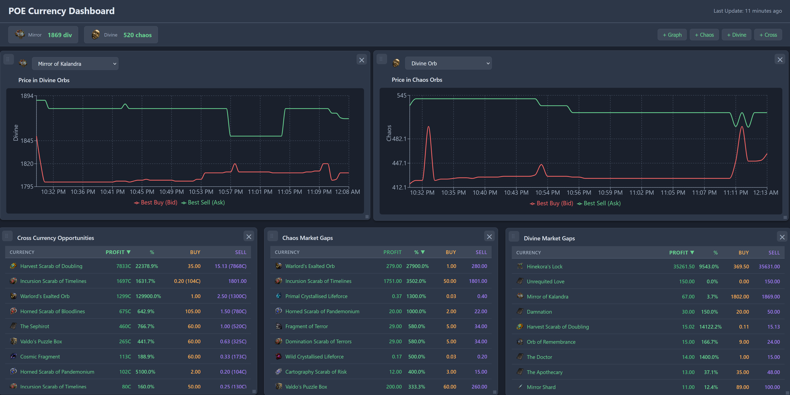

# POE Currency Dashboard

A real-time dashboard for monitoring Path of Exile currency trading opportunities, displaying live data from MongoDB with draggable and customizable widgets.

## Dashboard Preview



*Live dashboard showing price graphs, market gaps, and cross-currency arbitrage opportunities*

## Features

- **Real-time Data**: Auto-updates every 5 seconds from MongoDB
- **Currency Icons**: Visual icons from poe.ninja displayed next to currency names
- **Draggable Widgets**: Drag widgets around the dashboard
- **Multiple Widget Types**:
  - Price graphs with historical data
  - Market gap indicators (separate for Chaos and Divine markets)
  - Cross-currency arbitrage opportunities
  - Price tickers for key currencies with icons
- **Dark Mode**: Modern gray-blue theme optimized for desktop
- **Mobile Responsive**: Works on mobile devices as well

## Installation

### Prerequisites

- Node.js (v14 or higher)
- MongoDB Atlas account (or local MongoDB)
- npm or yarn

### Setup

1. **Install backend dependencies:**
   ```bash
   npm install
   ```

2. **Configure environment variables:**
   Create a `.env` file in the root directory (already created with defaults):
   ```env
   MONGO_URI=your_mongodb_connection_string
   DB_NAME=currency
   COLLECTION_NAME=price_history2
   PORT=5000
   ```

3. **Install frontend dependencies:**
   ```bash
   cd client
   npm install
   cd ..
   ```

4. **Start the backend server:**
   ```bash
   npm start
   ```
   Or for development with auto-restart:
   ```bash
   npm run dev
   ```

5. **Start the frontend (in a new terminal):**
   ```bash
   cd client
   npm start
   ```

The dashboard will open at `http://localhost:3000`

## Usage

### Dashboard Overview

The dashboard loads with 3 default widgets:
1. **Price Graph** - Shows historical price data for Mirror
2. **Market Gaps** - Lists the top 10 largest market gaps in chaos
3. **Cross Currency Gaps** - Shows arbitrage opportunities between chaos and divine pricing

### Adding Widgets

Click the buttons in the top-right toolbar to add new widgets:
- **+ Price Graph**: View historical price data for a currency
- **+ Market Gaps**: See the largest market gaps for trading opportunities
- **+ Cross Currency Gaps**: Find arbitrage opportunities between chaos and divine currencies

### Dragging Widgets

- Click and drag the widget header to move widgets around
- Click the × button in the top-right corner to remove a widget

### Price Tickers

At the top of the screen, you'll see permanent price tickers for:
- **Mirror** (in divines)
- **Divine** (in chaos)

Click on these tickers to automatically open a graph widget for that currency.

### Selecting Currencies in Graphs

Use the dropdown menu in the Price Graph widget to switch between different currencies. The graph displays:
- **Best Buy** (red line) - Lowest buy order price
- **Best Sell** (green line) - Highest sell order price
- **Actual Price** (blue line) - Calculated average price

## Customization

### Changing Colors

The dashboard uses a dark gray-blue theme. To change colors:

**Main colors** (`client/src/index.css`):
- Background: `#1a202c` (dark blue-gray)
- Main text: `#e2e8f0` (light gray)

**Widget colors** (`client/src/components/Dashboard.css`):
- Widget background: `#2d3748`
- Widget border: `#4a5568`
- Widget header: `#3d4758`

**Accent colors** (used throughout):
- Green: `#68d391` (for profits, positive values)
- Red: `#f56565` (for buy prices)
- Blue: `#4299e1` (for actual price, primary actions)
- Orange: `#f6ad55` (for buy prices)
- Purple: `#9f7aea` (for sell prices)

### Updating Update Frequency

Edit `client/src/App.js` line 32:
```javascript
const interval = setInterval(fetchData, 5000); // Change to desired milliseconds
```

### Adding New Widget Types

1. Create a new widget component in `client/src/components/widgets/`
2. Import it in `client/src/components/Dashboard.js`
3. Add it to the `WIDGET_TYPES` object
4. Add a case in the `renderWidget` function
5. Add a button to the toolbar

Example:
```javascript
// In Dashboard.js
const WIDGET_TYPES = {
  // ... existing types
  NEW_WIDGET: 'new-widget',
};

// Add button
<button onClick={() => addWidget(WIDGET_TYPES.NEW_WIDGET)}>
  + New Widget
</button>

// Add case in renderWidget
case WIDGET_TYPES.NEW_WIDGET:
  return <NewWidget {...commonProps} />;
```

### Modifying Data Update Frequency

Edit `client/src/App.js` line 29:
```javascript
const interval = setInterval(fetchData, 5000); // Change 5000 to desired milliseconds
```

### Changing Widget Default Positions

Edit the `DEFAULT_WIDGET_POSITIONS` object in `client/src/components/Dashboard.js`:
```javascript
const DEFAULT_WIDGET_POSITIONS = {
  'widget-id': { x: 50, y: 50, width: 600, height: 400 },
};
```

## Data Structure

The MongoDB collection stores documents with this structure:
```json
{
  "time": { "$date": "2025-10-27T18:26:22.597Z" },
  "type": "Chaos" | "Divine",
  "data": [
    {
      "currency": "Divine Orb",
      "buy": "306:1",    // Best buy price
      "sell": "404:1"    // Best sell price
    }
  ]
}
```

The backend automatically:
- Cleans OCR artifacts (removes `:1`, `1:`, multiple `:`)
- Filters out invalid data points
- Calculates market gaps
- Processes best buy/sell prices
- Applies outlier protection (rejects >30% price changes)

## Troubleshooting

### Connection Issues

If you can't connect to MongoDB:
1. Check your `MONGO_URI` in `.env`
2. Ensure your MongoDB Atlas IP whitelist includes your IP
3. Check that the database and collection names are correct

### Widget Not Appearing

- Check browser console for errors
- Ensure all dependencies are installed
- Try refreshing the page

### Data Not Updating

- Check backend terminal for errors
- Verify MongoDB documents exist and have the correct structure
- Check browser Network tab to see if API calls are succeeding

## Future Enhancements

- Persist widget positions to localStorage
- Add more chart types
- Implement WebSocket for true real-time updates
- Add price alerts
- Export data to CSV
- Add search/filter functionality

## License

Personal project - use as you like!

